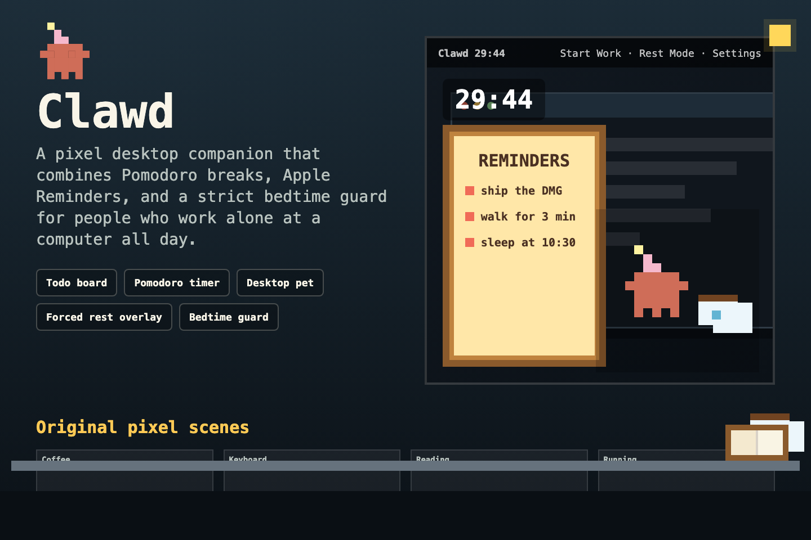
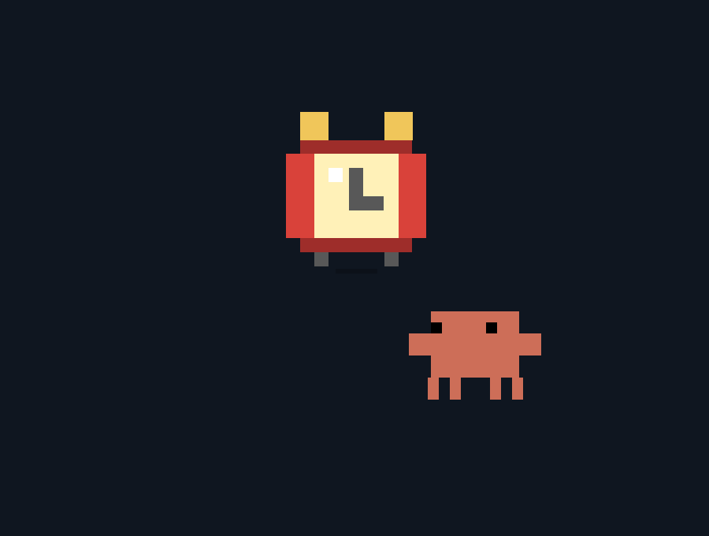
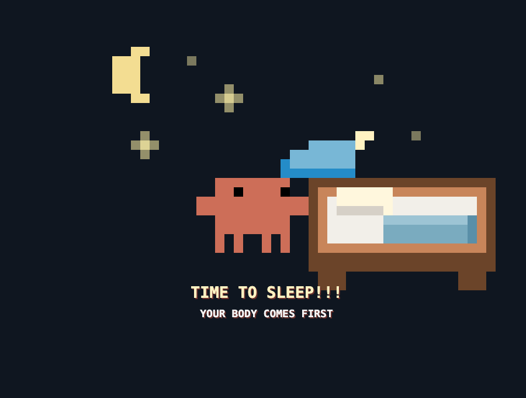

# Clawd



Clawd is a tiny macOS menu bar app for people who work alone in front of a computer all day. It combines a Pomodoro timer, Apple Reminders, and a pixel desktop pet into one intentionally strict health companion.

中文简介：Clawd 是一个三合一 macOS 小工具：Todo List、番茄钟、桌面宠物。它会提醒你每 30 分钟站起来休息，也会在你设定的睡觉时间强制进入睡眠守护，减少久坐和熬夜。

## Why Clawd Exists

Remote solo work makes it too easy to sit for hours without moving. Long sitting hurts your body, makes it easier to gain fat, and quietly destroys daily rhythm. Clawd is designed to be a friendly but firm interruption:

- Work for a focused block.
- Stand up when the break overlay appears.
- Keep your open reminders visible.
- Stop working when bedtime starts.

It is not a productivity dashboard. It is a small health guard that lives on top of your workspace.

## Features

- **Manual work mode**: Clawd starts in rest/pet mode. The 30 minute work timer only begins when you choose `Start Work`.
- **Forced break overlay**: when the work block ends, Clawd covers every connected display so you actually stand up instead of ignoring a notification.
- **Desktop pet**: transparent pixel Clawd animations rotate around screen edges while you work.
- **Apple Reminders board**: a collapsible pixel notice board shows up to 5 open reminders.
- **Bedtime guard**: default bedtime is 10:30 PM to 5:00 AM, with configurable start/end time.
- **Sleep preparation warnings**: Clawd warns before bedtime so you can wrap up.
- **Emergency exit**: bedtime mode has a once-per-bedtime-window emergency exit.
- **Multi-display aware**: timer, pet, and board follow the active screen.
- **Bilingual UI**: English and Chinese are supported.

## Screenshots

### Break Mode



### Bedtime Mode



### Animation Preview

The bundled HTML canvas animations live in [`Resources/Animations`](Resources/Animations). After cloning the repo, open [`Resources/Animations/clawd-preview-index.html`](Resources/Animations/clawd-preview-index.html) in a browser to inspect the animated scenes.

## Download

Download the latest DMG from the GitHub Releases page once releases are published.

Because this is currently a direct-distribution open-source build, the app is ad-hoc signed but not notarized. On first launch macOS may require right-clicking `Clawd.app` and choosing `Open`. For seamless public distribution, sign and notarize with an Apple Developer ID certificate.

## Permissions

Clawd uses a small set of macOS capabilities:

- **Reminders**: reads incomplete Apple Reminders to render the board.
- **Screen-covering windows**: shows break and bedtime overlays above normal app windows.
- **Display sleep**: bedtime guard calls `pmset displaysleepnow` after the lock countdown.
- **Lock-after-sleep setting**: on launch, Clawd configures macOS to require a password immediately after display sleep.

Clawd does not require Accessibility or Automation permission.

## Build Locally

Requirements:

- macOS 13+
- Xcode Command Line Tools

Build the app:

```sh
./Scripts/build.sh
```

The app bundle is created at:

```text
build/Clawd.app
```

Create a DMG:

```sh
./Scripts/package-dmg.sh 0.1.0
```

The DMG is created at:

```text
output/Clawd-0.1.0.dmg
```

## GitHub Release

This repository includes a release workflow. Push a version tag to build and upload a DMG:

```sh
git tag v0.1.0
git push origin v0.1.0
```

The workflow is defined in [`.github/workflows/release.yml`](.github/workflows/release.yml).

## Project Structure

```text
Sources/Clawd/          Native macOS app source
Resources/Animations/   Pixel HTML canvas animations
Resources/Info.plist    App metadata and permission strings
Scripts/build.sh        Builds Clawd.app
Scripts/package-dmg.sh  Builds a distributable DMG
Docs/                   README showcase assets
```

## Distribution Notes

For a production public download:

1. Join the Apple Developer Program.
2. Sign `Clawd.app` with a Developer ID Application certificate.
3. Notarize the app or DMG with Apple.
4. Publish the notarized DMG in GitHub Releases.

Without notarization, the DMG is still usable, but macOS Gatekeeper will show extra warnings.

## License

MIT License. See [LICENSE](LICENSE).
