# Clawd

作者：risingjerrys

Clawd 是一个给 macOS 用的像素桌面伙伴。它把 Todo List、番茄钟、桌面宠物合在一起，专门解决一个人长期坐在电脑前工作、忘记起身、容易熬夜的问题。

## 下载安装

直接下载最新 DMG：

[下载 Clawd-0.1.0.dmg](https://github.com/JNHFlow21/clawd/releases/download/v0.1.0/Clawd-0.1.0.dmg)

安装方式：

1. 下载 `Clawd-0.1.0.dmg`
2. 打开 DMG
3. 把 `Clawd.app` 拖到 `Applications`
4. 第一次打开时，如果 macOS 提示来自未知开发者，请右键点击 `Clawd.app`，选择 `Open`

备用下载页面：

[GitHub Releases](https://github.com/JNHFlow21/clawd/releases/tag/v0.1.0)

## 它是什么

Clawd 是一个三合一工具：

- Todo List：读取 Apple Reminders，显示你当前未完成的事项
- 番茄钟：工作 30 分钟后，强制你休息 3 分钟
- 桌面宠物：一个透明背景的像素 Clawd，会在屏幕边缘陪你工作

它不是一个单纯的效率工具。它更像是一个健康守门员：你可以专心工作，但时间到了，它会强制打断你，让你站起来活动一下。

## 为什么做它

很多人每天都是一个人坐在电脑前工作。时间久了很容易连续坐好几个小时，身体会变差，也更容易长脂肪。很多时候不是不知道要休息，而是工作一忙就会忘。

所以 Clawd 的设计很直接：

- 工作时，它尽量小，不挡你的界面
- 到点后，它会霸占屏幕，让你不能继续操作
- 休息结束后，自动回到正常工作状态
- 到了睡觉时间，它会强制进入睡眠守护，提醒你不要继续熬夜

默认节奏是工作 30 分钟，休息 3 分钟。睡眠守护默认从晚上 10:30 到早上 5:00，你也可以自己改时间。

## 功能展示

<table>
  <tr>
    <td width="33%">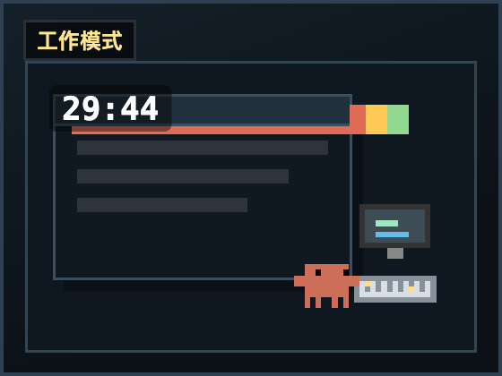<br><b>工作模式</b><br>手动点击 Start Work 后才开始计时。</td>
    <td width="33%">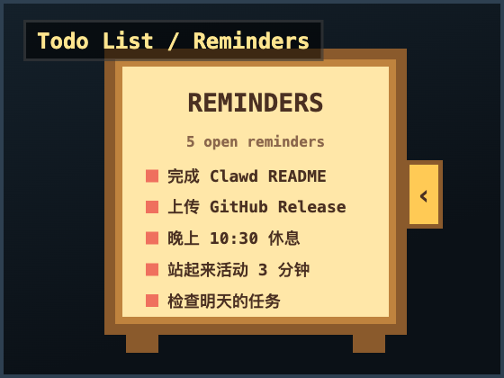<br><b>Todo List</b><br>读取 Apple Reminders，默认显示 5 条未完成事项。</td>
    <td width="33%">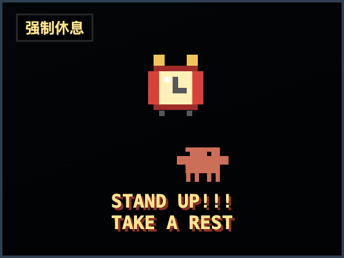<br><b>强制休息</b><br>时间到后覆盖屏幕，提醒你站起来活动。</td>
  </tr>
  <tr>
    <td width="33%">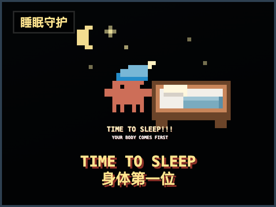<br><b>睡眠守护</b><br>到睡觉时间后进入霸屏状态，并在结束后锁屏息屏。</td>
    <td width="33%">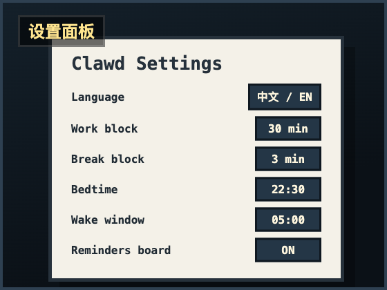<br><b>设置面板</b><br>工作时间、休息时间、睡眠时间、语言和提醒板都可以配置。</td>
    <td width="33%">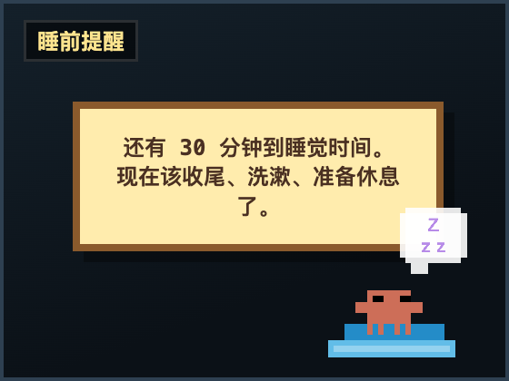<br><b>睡前提醒</b><br>睡觉前 1 小时、30 分钟、5 分钟会提醒你收尾。</td>
  </tr>
</table>

## 12 种工作状态动画

工作时 Clawd 会以透明背景显示在屏幕边缘，随机切换不同动画。下面这些是当前内置的 12 种状态。

<table>
  <tr>
    <td width="25%">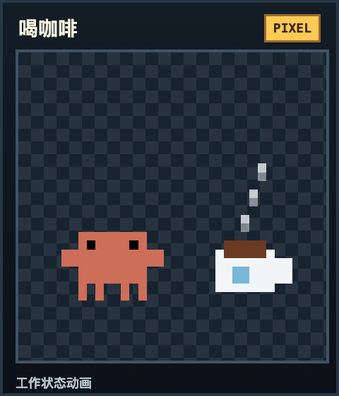<br><b>喝咖啡</b></td>
    <td width="25%">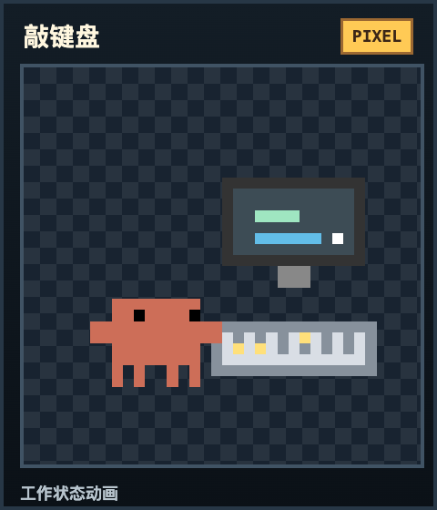<br><b>敲键盘</b></td>
    <td width="25%">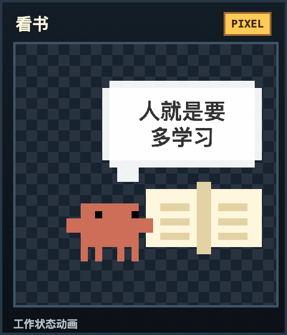<br><b>看书</b></td>
    <td width="25%">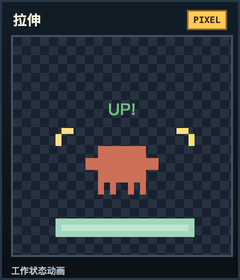<br><b>拉伸</b></td>
  </tr>
  <tr>
    <td width="25%">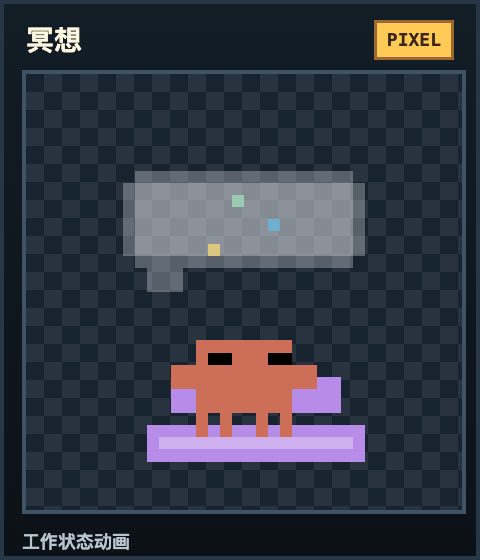<br><b>冥想</b></td>
    <td width="25%">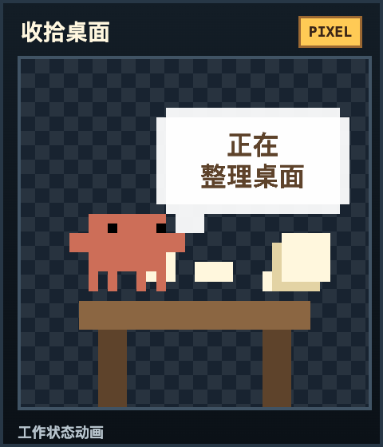<br><b>收拾桌面</b></td>
    <td width="25%">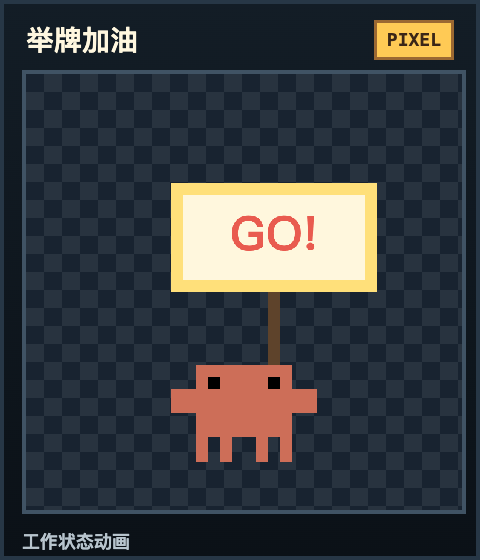<br><b>举牌加油</b></td>
    <td width="25%">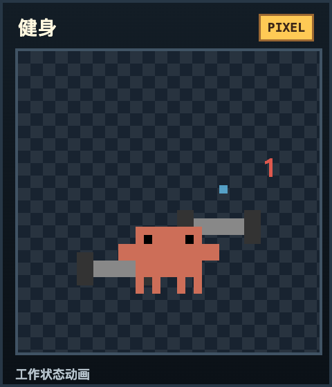<br><b>健身</b></td>
  </tr>
  <tr>
    <td width="25%">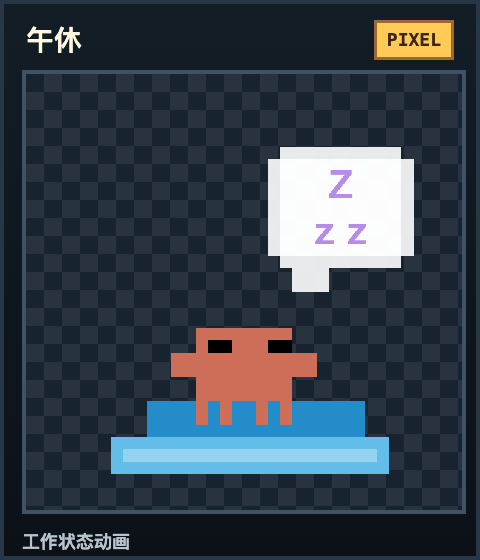<br><b>午休</b></td>
    <td width="25%">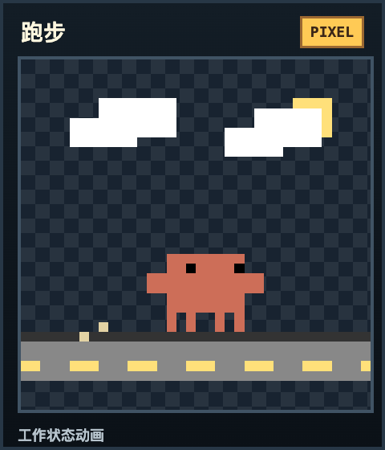<br><b>跑步</b></td>
    <td width="25%">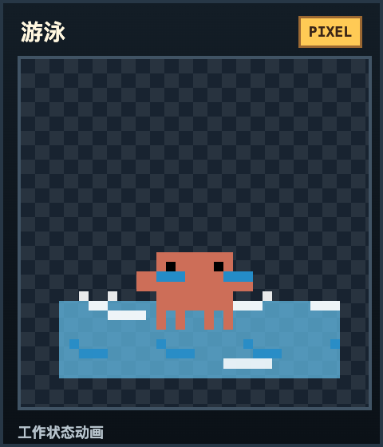<br><b>游泳</b></td>
    <td width="25%">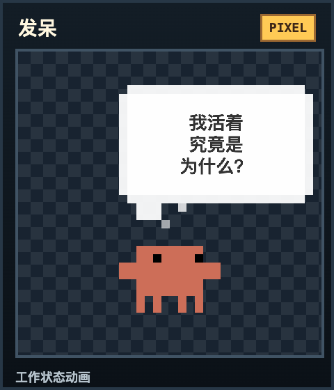<br><b>发呆</b></td>
  </tr>
</table>

## 休息逻辑

工作模式需要你手动开始。这样电脑开着但你还没开始工作时，Clawd 不会自动进入倒计时。

工作开始后：

- 默认倒计时 30 分钟
- 工作期间动画会随机切换
- 最后 10 秒切到闹钟准备动画
- 时间到后进入强制休息
- 休息期间倒计时放大显示，Clawd 和闹钟在屏幕中间动起来
- 休息结束后自动回到工作流程

这个设计的重点是强制站起来。普通通知太容易被忽略，所以 Clawd 会覆盖屏幕，让你不能继续点来点去。

## 睡眠守护

睡眠守护是为了减少熬夜。

默认规则：

- 开始时间：22:30
- 结束时间：05:00
- 睡前 1 小时提醒一次
- 睡前 30 分钟提醒一次
- 睡前 5 分钟提醒一次
- 到点后霸屏 15 分钟
- 霸屏结束后自动锁屏并息屏
- 每个睡眠窗口只有一次紧急退出机会

睡眠时间可以自己改。比如你不是 10:30 睡，也可以改成自己的作息。

## Todo List

Clawd 会读取 Apple Reminders 里的未完成事项，并用像素告示牌展示出来。

当前逻辑：

- 默认显示 5 条未完成事项
- 支持实时刷新
- 支持打开和收起
- 收起后变成小图标
- 展开时尽量避开 Clawd 动画区域

它不是完整的任务管理软件，而是让你在桌面上持续看到“还有什么没做”。

## 多屏幕支持

Clawd 会跟随当前活跃屏幕显示。多显示器工作时，时间、动画和提醒板会尽量移动到你正在使用的屏幕上。

休息和睡眠霸屏时，会覆盖所有连接的屏幕。

## 动画预览

所有 HTML 动画都在这里：

[Resources/Animations](Resources/Animations)

本地克隆后，可以直接打开这个预览页：

[clawd-preview-index.html](Resources/Animations/clawd-preview-index.html)

## 权限说明

Clawd 会用到这些 macOS 能力：

- Reminders：读取 Apple Reminders 里的未完成事项
- 屏幕覆盖窗口：用于休息和睡眠霸屏
- Display sleep：睡眠守护结束后调用系统息屏
- Lock-after-sleep：启动时会尝试把锁屏策略配置为息屏后立即需要密码

Clawd 不需要 Accessibility 权限，也不需要控制你的其他 App。

## 本地构建

要求：

- macOS 13+
- Xcode Command Line Tools

构建 App：

```sh
./Scripts/build.sh
```

生成 DMG：

```sh
./Scripts/package-dmg.sh 0.1.0
```

输出位置：

```text
output/Clawd-0.1.0.dmg
```

## GitHub Release

这个仓库已经包含 GitHub Actions 打包流程。推送版本 tag 后会自动打包并发布 DMG。

```sh
git tag v0.1.0
git push origin v0.1.0
```

Workflow 文件：

[.github/workflows/release.yml](.github/workflows/release.yml)

## 项目结构

```text
Sources/Clawd/          macOS App 源码
Resources/Animations/   像素 HTML 动画
Resources/Info.plist    App 元数据和权限说明
Scripts/build.sh        构建 Clawd.app
Scripts/package-dmg.sh  生成 DMG
Docs/assets/            README 展示图片
```

## 授权协议

本项目采用非商业授权协议。

你可以个人使用、学习、修改、二次开发、Fork 和分享，但不允许商用。任何商业使用都必须先获得作者 risingjerrys 的明确同意。

详细条款见 [LICENSE](LICENSE)。
